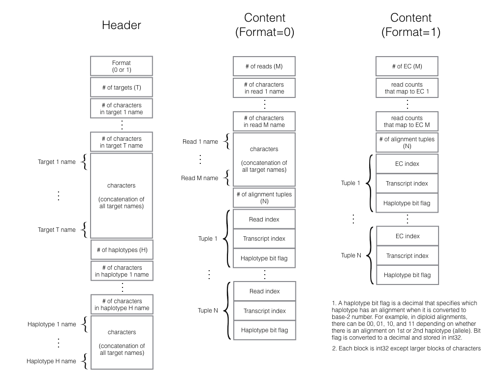

**kallisto-align** runs [kallisto](http://pachterlab.github.io/kallisto/), processes its internal data object storing the pseudo-alignments into an alignment incidence matrix, and exports the matrix in a pre-defined [binary format](#output) for use with other tools such as [emase](https://github.com/churchill-lab/emase) or [emase-zero](https://churchill-lab.github.io/emase-zero). It is a companion utility for our bigger project that aims to provide a way to compare, contrast, or combine the results of different alignment strategies as envisioned in our [alntools](https://churchill-lab.github.io/alntools).

Requirements
------------

CMake version >= 2.8.12<br />
HDF5 C library<br />
zlib


Installation
------------

To build ```kallisto-align``` you simply clone and compile.

```
> git clone https://github.com/churchill-lab/kallisto-align.git
> cd kallisto-align
> cmake .
> make
```

>**Note:** [kallisto](http://pachterlab.github.io/kallisto/) will be downloaded and compiled for you and be located at: ```external/src/kallisto-build/src/kallisto```.

You can now either keep the ```kallisto``` and ```kallisto-align``` binaries where they are or move them to a more suitable location, e.g. ```/usr/local/bin```.


Usage
-----

To run ```kallisto-align``` you need a [kallisto](http://pachterlab.github.io/kallisto/) index file and a FASTQ file.

A simplified example of building a [kallisto](http://pachterlab.github.io/kallisto/) index is:

```
> kallisto index -i transcriptome.idx transcriptome.fa
```

> Please refer to the [kallisto](http://pachterlab.github.io/kallisto/) documentation for all other options.

Once the index file is created, you can run ```kallisto-align```.

```
kallisto-align [OPTION...] - pseudo-align to kallisto-align format

      --help              Print help
  -l, --load              view the binary file
      --reads             create Reads version binary format, else
                          Equivalence Class
  -f, --file FASTQ FILE   Input Fastq File
  -i, --index INDEX FILE  Input Index File
  -b, --bin arg           kallisto-align output file
```

The binary file can be converted into [emase](https://github.com/churchill-lab/emase) format with the **emasify.py** script or [alntools](https://churchill-lab.github.io/alntools). It can also be used directly with [emase-zero](https://churchill-lab.github.io/emase-zero).

```
python emasify.py -i my_sample.bin -a my_sample.h5
```


Output
------


